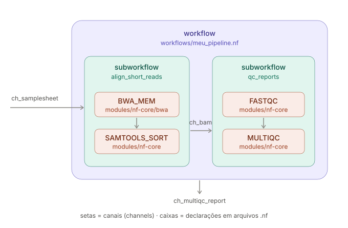

# Como um pipeline em Nextflow é estruturado?

## Estrutura de um pipeline

- **`module`**: É um processo atômico.
- **`workflow`**: Orquestra subworkflows e módulos. É o que define a ordem de execução.
- **`channel`**: É a aresta do grafo que carrega a informação para cada módulo/subworkflow.


 
## Examinando um script nextflow

Fornecemos um script de workflow funcional, embora minimalista, chamado [hello-world.nf](../hello_nextflow/hello-world.nf) que escreve 'Hello World!' com Nextflow.

Para começar, vamos abrir o script do fluxo de trabalho para que você tenha uma noção de como ele está estruturado. Então vamos executá-lo e procurar suas saídas.

::: {.callout-note collapse="true"}
## Ver conteúdo de `hello-world.nf`

```groovy
#!/usr/bin/env nextflow

/*
 * Use echo to print 'Hello World!' to a file
 */
process sayHello {

    output:
    path 'output.txt'

    script:
    """
    echo 'Hello World!' > output.txt
    """
}

workflow {

    main:
    // emit a greeting
    sayHello()

}
```
:::

::: {.callout-tip}
Um script de fluxo de trabalho Nextflow normalmente inclui uma ou mais definições de process e o workflow em si, além de alguns blocos opcionais (não presentes aqui) que apresentaremos mais tarde.
:::

### Componentes do hello-world.nf

- **`process`**:
    O primeiro bloco de código descreve um `process`. O corpo do processo deve conter um bloco script que especifica o comando a ser executado, **que pode ser qualquer coisa que você seria capaz de executar em um terminal de linha de comando.**
     - Estrutura mínima
        - Nome    `sayHello`
        - output  neste caso inclui o qualificador `path`
        - script  o que será executado
- **`workflow`**:
    O segundo bloco de código descreve o workflow em si. A definição de fluxo de trabalho começa com a palavra-chave workflow, seguida por um nome opcional, depois o corpo do fluxo de trabalho delimitado por chaves.

### Execute o workflow

Lance o fluxo de trabalho e monitore a execução, no terminal, execute o seguinte comando:

```bash
nextflow run hello-world.nf
```

### Encontre a saída e os logs de execução

Quando você executa o Nextflow, é criado um diretório chamado `work` onde ele escreverá todos os arquivos gerados durante a execução.

Dentro do diretório `work`, para cada chamada de processo, o Nextflow cria um subdiretório aninhado, nomeado com um hash para torná-lo único, onde preparará todas as entradas necessárias, escreverá arquivos auxiliares e escreverá logs e quaisquer saídas do processo.

Para examinar o diretório work execute:
```bash
tree -a work
```

- **.command.begin**: Metadados relacionados ao início da execução da chamada do processo
- **.command.err**: Mensagens de erro (stderr) emitidas pela chamada do processo
- **.command.log**: Saída de log completa emitida pela chamada do processo
- **.command.out**: Saída regular (stdout) pela chamada do processo
- **.command.run**: Script completo executado pelo Nextflow para executar a chamada do processo
- **.command.sh**: O comando que foi realmente executado pela chamada do processo
- **.exitcode**: O código de saída resultante do comando

O arquivo `.command.sh` é especialmente útil porque informa o comando principal que o Nextflow executou, *não incluindo toda a contabilidade e configuração de tarefa/ambiente*.

Caso o workflow seja executado novamente um novo subdiretório com um conjunto completo de arquivos de saída e log será criado para cada execução. Isso mostra que executar o mesmo fluxo de trabalho várias vezes não sobrescreverá os resultados de execuções anteriores.

## Aprimorando o Hello world

### Publique outputs

A saída produzida pelo nosso pipeline está enterrada no diretório `work` várias camadas abaixo. Isso é feito propositalmente; o Nextflow está no controle desse diretório e não devemos interagir com ele. No entanto, isso torna inconveniente recuperar saídas que nos interessam.

Para contornar isso, podemos publicar os outputs em um diretório designado usando definições de saída em nível de workflow.

### Uso básico 

Isso vai envolver dois novos pedaços de código:

1. Um bloco `publish`: dentro do corpo do workflow, declarando saídas de processo.
2. Um bloco `output` no script especificando opções de saída como modo e localização.

Adicione o bloco publish:

::: {.panel-tabset}
## Depois

```groovy
workflow {

    main:
    // emite uma saudação
    sayHello()

    publish:
    first_output = sayHello.out
}
```

## Antes

```groovy
workflow {

    main:
    // emite uma saudação
    sayHello()
}
```
:::
::: {.callout-note}

Você vê que podemos nos referir à saída do processo simplesmente fazendo sayHello().out, e atribuir a ela um nome arbitrário, first_output.

:::

Adicione o bloco `output` ao script onde o caminho do diretório de saída será especificado:

::: {.panel-tabset}
## Depois

```groovy
workflow {

    main:
    // emite uma saudação
    sayHello()

    publish:
    first_output = sayHello.out
}

output {
    first_output {
        path 'hello_world'
    }
}
```

## Antes

```groovy
workflow {

    main:
    // emite uma saudação
    sayHello()

    publish:
    first_output = sayHello.out
}
```
:::

Execute o workflow modificado:

```bash
nextflow run hello-world.nf
```

## Usando inputs variáveis

Em seu estado atual, nosso fluxo de trabalho usa uma saudação codificada no comando do processo. Queremos adicionar alguma flexibilidade usando uma variável de entrada, para que possamos mudar mais facilmente a saudação em tempo de execução.

Isso requer que façamos três conjuntos de mudanças em nosso script:

1. Alterar o processo para esperar uma entrada variável
2. Configurar um parâmetro de linha de comando para capturar a entrada do usuário
3. Passar a entrada para o processo no corpo do fluxo de trabalho

Vamos fazer essas mudanças uma de cada vez.

Primeiro, vamos adaptar a definição do processo para aceitar uma entrada chamada greeting.

::: {.panel-tabset}
## Depois

```groovy
process sayHello {

    input:
    val greeting

    output:
    path 'output.txt'
```

## Antes

```groovy
process sayHello {

    output:
    path 'output.txt'
```
:::

Agora trocamos o valor codificado original pelo valor da variável de entrada que esperamos receber.

::: {.panel-tabset}
## Depois

```groovy
    script:
    """
    echo '${greeting}' > output.txt
    """
```

## Antes

```groovy
    script:
    """
    echo 'Hello World!' > output.txt
    """
```
:::

Aqui, queremos criar um parâmetro chamado `--input`. Em princípio podemos escrevê-lo em qualquer lugar, mas podemos colocá-lo diretamente em `sayHello()`.

No bloco do fluxo de trabalho, faça a seguinte alteração de código:

::: {.panel-tabset}
## Depois

```groovy
    // emite uma saudação
    sayHello(params.input)
```

## Antes

```groovy
    // emite uma saudação
    sayHello()
```
:::

Agora execute o workflow

```bash
nextflow run hello-world.nf --input 'Oi mundo!'
```

# Gerenciando execução do workflow

Saber como lançar fluxos de trabalho e recuperar saídas é ótimo, mas você rapidamente descobrirá que há alguns outros aspectos do gerenciamento de fluxo de trabalho que tornarão sua vida mais fácil, especialmente se você estiver desenvolvendo seus próprios fluxos de trabalho.

Aqui mostramos como usar o recurso -resume para quando você precisar relançar o mesmo fluxo de trabalho, como inspecionar o log de execuções passadas com nextflow log, e como excluir diretórios work mais antigos com nextflow clean.

### Relance um fluxo de trabalho com `-resume`

Às vezes, você vai querer executar novamente um pipeline que já lançou anteriormente sem refazer nenhuma etapa que já foi concluída com sucesso.

O Nextflow tem uma opção chamada -resume que permite fazer isso. Especificamente, neste modo, quaisquer processos que já foram executados com exatamente o mesmo código, configurações e entradas serão ignorados. Isso significa que o Nextflow só executará processos que você adicionou ou modificou desde a última execução, ou aos quais você está fornecendo novas configurações ou entradas.

Para usá-lo, basta adicionar -resume ao seu comando e executá-lo:
```bash
nextflow run hello-world.nf --input 'Konnichiwa!' -resume
```

### Inspecione o log ou limpe execuções passadas

Sempre que você lança um fluxo de trabalho nextflow, uma linha é escrita em um arquivo de log chamado history, em um diretório oculto chamado .nextflow no diretório de trabalho atual.

::: {.callout-note collapse="true"}
## Ver exemplo do arquivo `.nextflow/history`

```default
2024-11-05 10:32:15	5m 23s	golden_cantor	OK	a1b2c3d4	1a2b3c4d-...	nextflow run hello-world.nf
2024-11-05 10:41:07	3m 12s	elegant_curie	OK	a1b2c3d4	5e6f7a8b-...	nextflow run hello-world.nf --input 'Bonjour!'
2024-11-05 11:02:44	4m 58s	naughty_lorenz	ERR	a1b2c3d4	9c0d1e2f-...	nextflow run hello-world.nf --input 'Konnichiwa!' -resume
```

Cada linha: timestamp, duração, nome da execução, status, ID de revisão, ID de sessão, linha de comando.
:::

Este arquivo fornece o timestamp, nome da execução, status, ID de revisão, ID de sessão e linha de comando completa para cada execução do Nextflow que foi lançada a partir do diretório de trabalho atual.

Uma maneira mais conveniente de acessar essas informações é usar o comando nextflow log.

```bash
nextflow log
```

Durante o processo de desenvolvimento, você normalmente executará seu rascunho de pipeline um grande número de vezes, o que pode levar a um acúmulo de muitos arquivos em muitos subdiretórios.

Felizmente, o Nextflow inclui um subcomando útil clean que pode excluir automaticamente os subdiretórios work de execuções passadas que você não se importa mais.

Existem várias opções para determinar o que excluir.

Aqui mostramos um exemplo que exclui todos os subdiretórios de execuções antes de uma determinada execução, especificada usando seu nome de execução.

Primeiro usamos a flag de execução de teste -n para verificar o que será excluído dado o comando:
```bash
nextflow clean -before golden_cantor -n
```

Se a saída parecer como esperado e você quiser prosseguir com a exclusão, execute novamente o comando com a flag -f em vez de -n:
```bash
nextflow clean -before golden_cantor -f
```