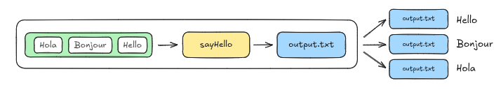
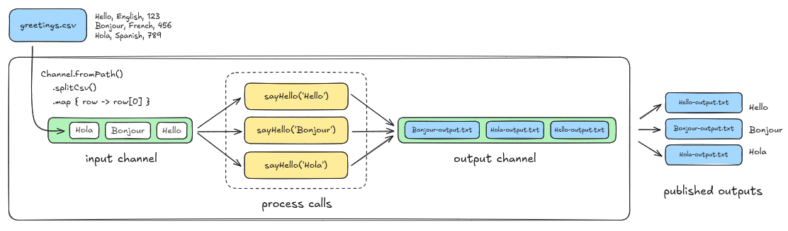
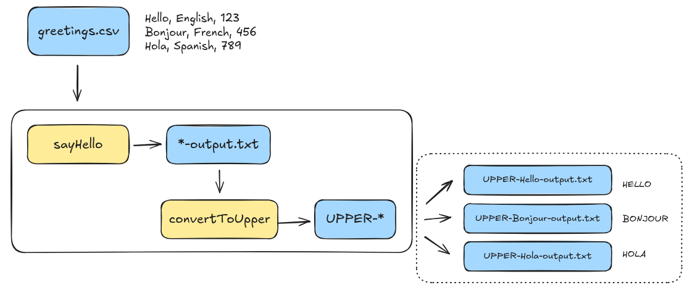
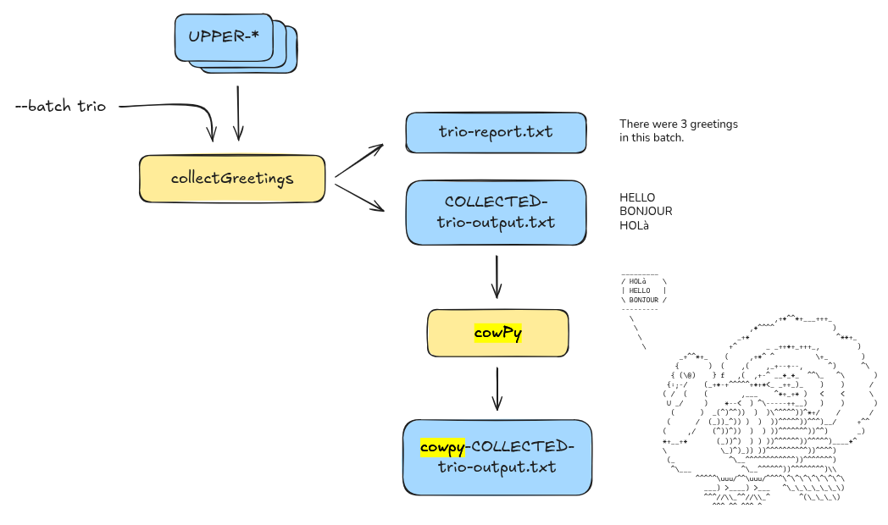

# Componentes de um Workflow

## Channels

Na maioria dos pipelines realistas, queremos processar múltiplos valores (vários arquivos FASTQ, por exemplo), então precisamos de uma maneira mais sofisticada de lidar com entradas.

É para isso que servem os canais do Nextflow. Canais são filas projetadas para lidar com entradas eficientemente e transportá-las de uma etapa para outra em fluxos de trabalho de múltiplas etapas, ao mesmo tempo que fornecem paralelismo integrado e muitos benefícios adicionais.

### Forneça entradas variáveis através de um canal explicitamente

Existem várias fábricas de canais que podemos usar para configurar um canal. Para manter as coisas simples por enquanto, vamos usar a fábrica de canais mais básica, chamada channel.of, que criará um canal contendo um único valor. Funcionalmente, isso será semelhante a como tínhamos configurado antes, mas em vez de ter o Nextflow criando um canal implicitamente, estamos fazendo isso explicitamente agora.

Adicione o channel greeting_ch em [hello_channels.nf](../hello_nextflow/hello-channels.nf):

```groovy

workflow {

    main:
    // cria um canal para entradas
    greeting_ch = channel.of('Hello','Bonjour','Hola', "Oi")
    // emite uma saudação
    sayHello(greeting_ch)

    publish:
    first_output = sayHello.out
}
```

Isso cria um canal chamado greeting_ch usando a fábrica de canais channel.of(), que configura um canal de fila simples, e carrega a string 'Hello Channels!' para usar como o valor da saudação.

Execute o workflow:

```bash
nextflow run hello-channels.nf
```

Os canais do Nextflow são construídos de uma maneira que nos permite operar em seu conteúdo usando operadores, que cobriremos em detalhes mais tarde neste capítulo.

Por enquanto, vamos apenas mostrar como usar um operador super simples chamado `view()` para inspecionar o conteúdo de um canal. Você pode pensar em `view()` como uma ferramenta de depuração, como uma instrução `print()` em Python, ou seu equivalente em outras linguagens.

Adicione esta pequena linha ao bloco workflow:

```groovy
workflow {

    main:
    // cria um canal para entradas
    greeting_ch = channel.of('Hello','Bonjour','Hola', "Oi")
                         .view()
    // emite uma saudação
    sayHello(greeting_ch)

    publish:
    first_output = sayHello.out
}
```

Agora execute o fluxo de trabalho novamente:
```groovy
nextflow run hello-channels.nf
```

Como você pode ver, isso exibe o conteúdo do canal no console. Aqui temos apenas um elemento, mas quando começarmos a carregar múltiplos valores no canal na próxima seção, você verá que isso está configurado para exibir um elemento por linha.



## Workflows

A maioria dos fluxos de trabalho do mundo real envolve mais de uma etapa. Neste módulo de treinamento, você aprenderá como conectar processos em um fluxo de trabalho com múltiplas etapas.

Agora veremos como realizar o seguinte:

1. Fazer os dados fluírem de um processo para o próximo
2. Coletar saídas de múltiplas chamadas de processo em uma única chamada de processo
3. Passar parâmetros adicionais para um processo
4. Lidar com múltiplas saídas provenientes de um processo

Para demonstrar, continuaremos construindo sobre o exemplo Hello World agnóstico de domínio das Partes 1 e 2. Desta vez, faremos as seguintes alterações em nosso fluxo de trabalho para refletir melhor como as pessoas constroem fluxos de trabalho reais:

1. Adicionar **uma segunda etapa que converte a saudação para maiúsculas.**
2. Adicionar uma terceira etapa que coleta todas as saudações transformadas e as escreve em um único arquivo.

Execute [hello-workflow.nf](../hello_nextflow/hello-workflow.nf) :

```bash
nextflow run hello-workflow.nf
```

Este diagrama resume a operação atual do fluxo de trabalho. Deve parecer familiar, exceto que agora estamos mostrando explicitamente que as saídas do processo são empacotadas em um canal, assim como as entradas foram. Vamos colocar esse canal de saída em bom uso em um minuto.



## Adicionando uma segunda etapa

Vamos adicionar uma etapa para converter cada saudação para maiúsculas.



Para isso, precisamos fazer três coisas:

- Definir o comando que vamos usar para fazer a conversão para maiúsculas.
- Escrever um novo processo que envolve o comando de conversão para maiúsculas.
- Chamar o novo processo no bloco workflow e configurá-lo para receber a saída do processo sayHello() como entrada.

1. Comando de conversão para maiúsculas e teste-o no terminal:

```bash
tr '[a-z]' '[A-Z]'
```

2. Adicionando um novo processo em nosso workflow que irá executar esse comando

```groovy
/*
 * Use uma ferramenta de substituição de texto para converter a saudação para maiúsculas
 */
process convertToUpper {

    input:
    path input_file

    output:
    path "UPPER-${input_file}"

    script:
    """
    cat '${input_file}' | tr '[a-z]' '[A-Z]' > 'UPPER-${input_file}'
    """
}
```

::: {.callout-tip}

Neste, componhamos o segundo nome de arquivo de saída com base no nome do arquivo de entrada, de forma similar ao que fizemos originalmente para a saída do primeiro processo.

:::

3. Adicione uma chamada ao novo processo no bloco workflow


```groovy
workflow {

    main:
    // cria um canal para entradas a partir de um arquivo CSV
    greeting_ch = channel.fromPath(params.input)
                        .splitCsv()
                        .map { line -> line[0] }
    // emite uma saudação
    sayHello(greeting_ch)
    // converte a saudação para maiúsculas
    convertToUpper()

    publish:
    first_output = sayHello.out
}
```

4. Passe a saída do primeiro processo para o segundo processo

```groovy
    // converte a saudação para maiúsculas
    convertToUpper(sayHello.out)
```

5. Configure a publicação de saída do fluxo de trabalho

```groovy

    publish:
    first_output = sayHello.out
    uppercased = convertToUpper.out
}
```


```groovy
output {
    first_output {
        path 'hello_workflow'
        mode 'copy'
    }
    uppercased {
        path 'hello_workflow'
        mode 'copy'
    }
}
```

Execute o fluxo de trabalho com -resume

```bash
nextflow run hello-workflow.nf -resume
```

## Módulos

É uma boa prática armazenar seus módulos em um diretório específico. Você pode chamar esse diretório de qualquer nome, mas a convenção é chamá-lo de modules/.


```bash
mkdir modules
```

Na sua forma mais simples, transformar um processo existente em um módulo é pouco mais do que uma operação de copiar e colar. Vamos criar um esboço de arquivo para o módulo, copiar o código relevante e então excluí-lo do arquivo principal do fluxo de trabalho.

Então tudo o que precisaremos fazer é adicionar uma declaração include para que o Nextflow saiba trazer o código relevante em tempo de execução.

Crie um novo arquivo chamado sayHello.nf dentro da pasta modules e cole o processo sayHello

`modules/sayHello.nf`
```groovy
/*
 * Usa echo para imprimir 'Hello World!' em um arquivo
 */
process sayHello {

    input:
    val greeting

    output:
    path "${greeting}-output.txt"

    script:
    """
    echo '${greeting}' > '${greeting}-output.txt'
    """
}
```

Uma vez feito isso, apague o processo sayHello do arquivo de fluxo de trabalho.

A sintaxe para incluir um processo de um módulo é bastante direta:


```groovy
include { <PROCESS_NAME> } from '<path_to_module>'
```

Vamos inserir isso acima do bloco params e preenchê-lo adequadamente.


```groovy
// Inclui módulos
include { sayHello } from './modules/sayHello.nf'

/*
* Pipeline parameters
*/
params {
    input: Path = 'data/greetings.csv'
    batch: String = 'batch'
}
```

Execute o fluxo de trabalho


```groovy
nextflow run hello-modules.nf -resume 
```


::: {.callout-note}

Tentem modularizar o processo convertToUpper()

:::

## Containers

Nas Partes 1-4 deste curso de treinamento, vimos como usar os blocos de construção básicos do Nextflow para montar um fluxo de trabalho simples capaz de processar texto, paralelizar a execução se houvesse múltiplas entradas e coletar os resultados para processamento adicional.

No entanto, você estava limitado às ferramentas básicas do UNIX disponíveis no seu ambiente. Tarefas do mundo real frequentemente requerem várias ferramentas e pacotes não incluídos por padrão. Normalmente, você precisaria instalar essas ferramentas, gerenciar suas dependências e resolver quaisquer conflitos.

Tudo isso é muito tedioso e irritante, então vamos mostrar como usar contêineres para resolver esse problema de forma muito mais conveniente.

Um contêiner é uma unidade de software leve, autônoma e executável criada a partir de uma imagem de contêiner que inclui tudo o que é necessário para executar uma aplicação, incluindo código, bibliotecas do sistema e configurações. Como você pode imaginar, isso será muito útil para tornar seus pipelines mais reproduzíveis.

Execute hello-containers.nf
```bash
nextflow run hello-containers.nf
```

Vamos usar um "container" manualmente

Baixe a imagem do container

```bash
docker pull 'community.wave.seqera.io/library/cowpy:1.1.5--3db457ae1977a273'
```

Use o contêiner para executar cowpy como um comando único

```bash
docker run --rm -it 'community.wave.seqera.io/library/cowpy:1.1.5--3db457ae1977a273' /bin/bash
```

 Execute os seguintes comandos dentro do container:

 ```bash
echo "Hello Containers" | cowpy -c tux
 ```

### Use contêineres no Nextflow

O Nextflow tem suporte integrado para executar processos dentro de contêineres para permitir que você execute ferramentas que não tem instaladas no seu ambiente de computação. Isso significa que você pode usar qualquer imagem de contêiner que desejar para executar seus processos, e o Nextflow cuidará de puxar a imagem, montar os dados e executar o processo dentro dela.

Para demonstrar isso, vamos adicionar uma etapa cowpy ao pipeline que estivemos desenvolvendo, após a etapa collectGreetings.




::: {.callout-note}

Tentem escrever o módulo cowpy.nf

:::

:::: {.callout-tip collapse="true"}
## Mostrar resposta

Podemos modelar nosso processo cowpy nos outros processos que escrevemos anteriormente.


```groovy
#!/usr/bin/env nextflow

// Gera arte ASCII com cowpy
process cowpy {

    input:
    path input_file
    val character

    output:
    path "cowpy-${input_file}"

    script:
    """
    cat ${input_file} | cowpy -c "${character}" > cowpy-${input_file}
    """

```

O processo espera um input_file contendo as saudações, bem como um valor character.

A saída será um novo arquivo de texto contendo a arte ASCII gerada pela ferramenta cowpy.

Adicione cowpy ao fluxo de trabalho

```groovy
// Inclui módulos
include { sayHello } from './modules/sayHello.nf'
include { convertToUpper } from './modules/convertToUpper.nf'
include { collectGreetings } from './modules/collectGreetings.nf'
include { cowpy } from './modules/cowpy.nf'
```

Vamos conectar o processo cowpy() à saída do processo collectGreetings(), que como você deve se lembrar produz duas saídas:

- collectGreetings.out.outfile contém o arquivo de saída *<--o que queremos*
- collectGreetings.out.report contém o arquivo de relatório com a contagem de saudações por lote

```groovy
    main:
    // cria um canal para entradas de um arquivo CSV
    greeting_ch = channel.fromPath(params.input)
                        .splitCsv()
                        .map { line -> line[0] }
    // emite uma saudação
    sayHello(greeting_ch)
    // converte a saudação para maiúsculas
    convertToUpper(sayHello.out)
    // coleta todas as saudações em um arquivo
    collectGreetings(convertToUpper.out.collect(), params.batch)
    // gera arte ASCII das saudações com cowpy
    cowpy(collectGreetings.out.outfile, params.character)
```

Adicione o parâmetro character ao bloco param


```groovy
/*
* Parâmetros do pipeline
*/
params {
    input: Path = 'data/greetings.csv'
    batch: String = 'batch'
    character: String = 'turkey'
}
```

Atualize as saídas do workflow


```groovy

    publish:
    first_output = sayHello.out
    uppercased = convertToUpper.out
    collected = collectGreetings.out.outfile
    batch_report = collectGreetings.out.report
    cowpy_art = cowpy.out

```

Atualize o bloco output

```groovy
output {
    first_output {
        path 'hello_containers/intermediates'
        mode 'copy'
    }
    uppercased {
        path 'hello_containers/intermediates'
        mode 'copy'
    }
    collected {
        path 'hello_containers/intermediates'
        mode 'copy'
    }
    batch_report {
        path 'hello_containers'
        mode 'copy'
    }
    cowpy_art {
        path 'hello_containers'
        mode 'copy'
    }
}
```

Execute o workflow
```groovy
nextflow run hello-containers.nf
```


::: {.callout}

Oh não, há um erro! O código de erro dado por error exit status (127) significa que o executável que pedimos não foi encontrado.

Isso faz sentido, já que estamos chamando a ferramenta cowpy mas ainda não especificamos um contêiner (ops).

:::

Use um contêiner para executar o processo cowpy


```groovy
process cowpy {

    container 'community.wave.seqera.io/library/cowpy:1.1.5--3db457ae1977a273'

    input:
    path input_file
    val character

    output:
    path "cowpy-${input_file}"

    script:
    """
    cat ${input_file} | cowpy -c "${character}" > cowpy-${input_file}
    """
}
```

Execute o workflow
```groovy
nextflow run hello-containers.nf
```
::::

# Configuração

Todo pipeline sério é executado em contextos diferentes: laptop pessoal, cluster HPC, nuvem. O objetivo do arquivo `nextflow.config` é permitir mudar **como** o pipeline roda **sem tocar no código do workflow**.

## O arquivo `nextflow.config`

Quando você roda `nextflow run <script>`, o Nextflow carrega automaticamente um arquivo chamado `nextflow.config` no diretório atual (se existir).

Ele pode conter:

- Valores padrão de parâmetros (`params`)
- Diretivas de processo (`cpus`, `memory`, `container`, `publishDir`, ...)
- Habilitação de contêineres/conda (`docker.enabled`, `conda.enabled`, ...)
- Perfis de configuração (`profiles { ... }`)
- Configurações de saída (`outputDir`, `workflow.output.mode`)

## Movendo `params` para o config

Manter valores padrão no arquivo de configuração deixa o código do workflow mais limpo e permite alterar valores sem editar o script.

::: {.panel-tabset}
## Depois

`nextflow.config`:
```groovy
docker.enabled = true

params {
    input     = 'data/greetings.csv'
    batch     = 'batch'
    character = 'turkey'
}
```

No workflow, mantemos só a declaração dos tipos:
```groovy
params {
    input: Path
    batch: String
    character: String
}
```

## Antes

`nextflow.config`:
```groovy
docker.enabled = true
```

No workflow, os valores padrão estavam no próprio script:
```groovy
params {
    input: Path     = 'data/greetings.csv'
    batch: String   = 'batch'
    character: String = 'turkey'
}
```
:::

## Diretivas de processo

As diretivas controlam recursos e comportamento de execução dos processos.

```groovy
process {
    cpus   = 1
    memory = 1.GB

    withName: 'cowpy' {
        cpus   = 2
        memory = 2.GB
    }
}
```

- Bloco `process { ... }`: aplica a **todos** os processos
- `withName: 'nome'`: aplica só a um processo específico
- Diretivas comuns: `cpus`, `memory`, `time`, `container`, `conda`, `publishDir`, `errorStrategy`

## Tecnologia de empacotamento de software

O mesmo pipeline pode rodar com Docker, Singularity ou Conda — basta habilitar no config.

```groovy
docker.enabled      = true
// ou
singularity.enabled = true
// ou
conda.enabled       = true
```

E no módulo, cada processo declara sua imagem/pacote:
```groovy
process cowpy {
    container 'community.wave.seqera.io/library/cowpy:1.1.5--3db457ae1977a273'
    conda     'conda-forge::cowpy==1.1.5'
    ...
}
```

::: {.callout-tip}
Se Docker e Conda estiverem habilitados juntos, o Nextflow **prioriza contêineres**.
:::

## Perfis (`profiles`)

Perfis são conjuntos nomeados de configuração que você ativa em tempo de execução com `-profile`.

```groovy
profiles {
    my_laptop {
        process.executor = 'local'
        docker.enabled   = true
    }
    hpc {
        process.executor = 'slurm'
        conda.enabled    = true
        process.resourceLimits = [
            memory: 750.GB,
            cpus:   200,
            time:   30.d
        ]
    }
    test {
        params.input     = 'data/greetings.csv'
        params.batch     = 'test'
        params.character = 'dragonandcow'
    }
}
```

Ativação:
```bash
nextflow run hello-config.nf -profile my_laptop
nextflow run hello-config.nf -profile my_laptop,test   # combinando perfis
```

::: {.callout-note}
Este é exatamente o mecanismo que pipelines nf-core usam com `-profile docker,test` — que veremos na próxima parte do curso.
:::

## Arquivo de parâmetros (`-params-file`)

Quando você tem muitos parâmetros ou quer distribuir uma configuração de execução, um arquivo YAML/JSON é mais prático que a linha de comando.

`test-params.yaml`:
```yaml
input:     "data/greetings.csv"
batch:     "yaml"
character: "stegosaurus"
```

Execução:
```bash
nextflow run hello-config.nf -params-file test-params.yaml
```

::: {.callout-important}
No arquivo de parâmetros use **`:`** (YAML). No `nextflow.config` use **`=`** (Groovy).
:::

## Ordem de precedência

Quando o mesmo parâmetro é definido em vários lugares, o Nextflow segue esta ordem (do mais forte ao mais fraco):

1. Linha de comando (`--param valor`)
2. Arquivo de parâmetros (`-params-file`)
3. Arquivos de configuração (`-c custom.config`, depois `nextflow.config`)
4. Valores padrão no bloco `params` do workflow

## Inspecionar a config resolvida

Para descobrir com quais valores o pipeline vai rodar **sem executar nada**:

```bash
nextflow config
nextflow config -profile my_laptop,test
```

O comando devolve toda a configuração já resolvida — muito útil para debug quando algo não está pegando o valor esperado.

## Relatório de recursos

Para descobrir quanto CPU/memória cada processo realmente usa:

```bash
nextflow run hello-containers.nf -with-report relatorio.html
```

Isso gera um HTML com utilização por processo — base para ajustar `cpus`/`memory` no config.
